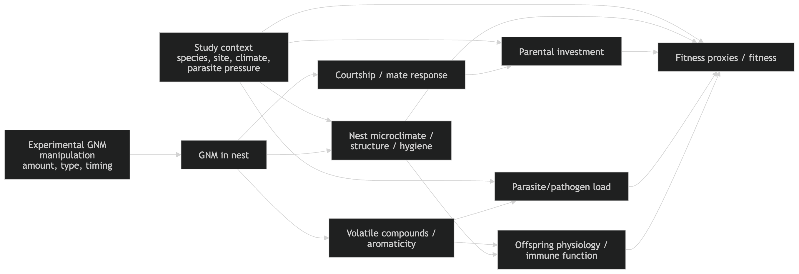

Many animals construct nests. Nests are often considered extended phenotypes that shape survival and reproduction beyond the builder’s body. Birds are key examples of nest builders, and many add fresh green plant material to their nests. Yet, the adaptive value of this behaviour remains debated. Non-mutually exclusive hypotheses propose roles in courtship signalling, parasite defence, or direct enhancement of offspring condition. Here, we conducted a pre-registered systematic review and meta-analysis of 28 experimental studies (published and unpublished), spanning seven bird species and 274 effect sizes, to test whether green nest material influences fitness, and to evaluate the competing functional explanations. Our synthesis shows that while green nest material can enhance avian fitness, this effect depends on the fitness proxy used, and its functional role remains unresolved. The strongest predictor was experimental design, strongly influencing the outcomes, challenging the role of aromatic compounds in the fitness benefits of green nest material. Our meta-analysis supports the importance of green nest material on fitness, but calls for more research to elucidate its mechanisms.

I have been playing around with the idea of what making DAGs for Meta-analysis would look like. I think it is simpler to draw them at the level of the meta-analysis itself.. something like this for this project (I think okay, I am not 100% sure).

But what would happen if we were to draw these DAGs at the step of data extraction, would it be possible to do? I am not sure. They could help us decide which estimate to extract by making explicit whether a reported adjustment is for a plausible confounder, a mediator or a collider, and whether studies that look very similar are actually estimating the same causal effect. In that sense, I think DAGs could not only be useful for interpretation after extraction, they could improve the extraction process itself.